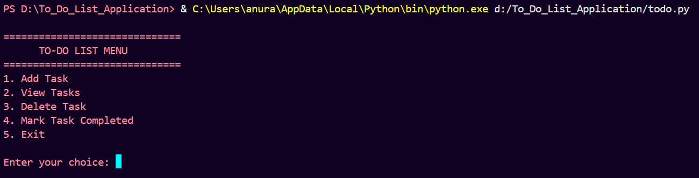
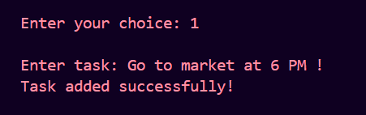
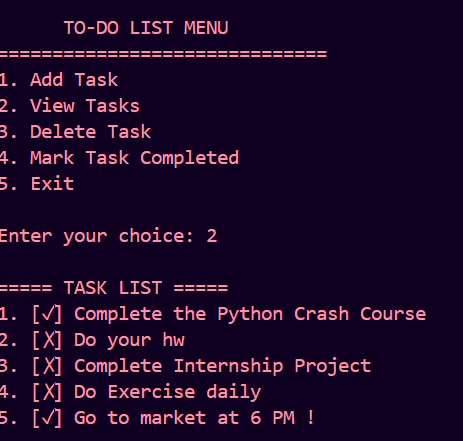
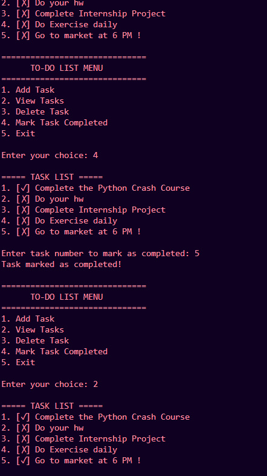
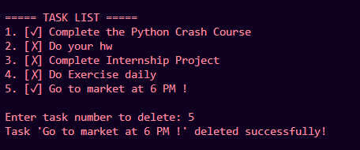
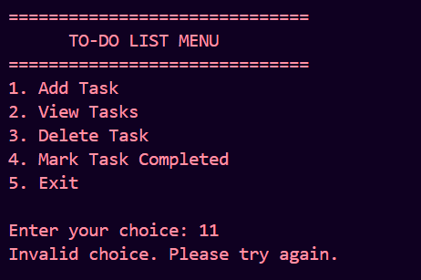

# To-Do List Application

## Overview

The To-Do List Application is a Python-based command-line application that helps users manage their daily tasks efficiently.

Users can add new tasks, view existing tasks, mark tasks as completed, and delete tasks. All task data is stored permanently using a JSON file, ensuring tasks remain available even after the program is closed.

## Features

* Add new tasks
* View all tasks
* Delete tasks
* Mark tasks as completed
* Store tasks using JSON
* Persistent task storage
* Input validation
* Error handling for invalid task numbers
* User-friendly menu-driven interface

## Technologies Used

* Python 3
* JSON File Handling

## Project Structure

To_Do_List_Application/

├── todo.py

├── tasks.json

├── README.md

└── screenshots/

    ├── program_start.png

    ├── add_task.png

    ├── view_tasks.png

    ├── mark_completed.png

    ├── delete_task.png

    └── invalid_input.png

## How to Run the Project

### Step 1: Open Terminal

Navigate to the project directory.

### Step 2: Run the Program

```bash
python todo.py
```

### Step 3: Choose an Option

1. Add Task
2. View Tasks
3. Delete Task
4. Mark Task Completed
5. Exit

## Screenshots

### Program Start



### Add Task



### View Tasks



### Mark Task Completed



### Delete Task



### Invalid Input Handling



## Concepts Used

* Functions
* Loops
* Conditional Statements
* JSON File Handling
* Exception Handling
* CRUD Operations
* Data Persistence

## Learning Outcomes

Through this project, the following concepts were practiced:

* Reading and writing JSON files
* Building menu-driven applications
* Managing persistent data
* Implementing CRUD operations
* Error handling and validation
* Modular programming

## Future Enhancements

* Task deadlines
* Task priorities
* Search tasks
* Task categories
* GUI version using Tkinter
* Database integration

## Author

Anurag

# To-Do List Application

## Overview

The To-Do List Application is a Python-based command-line application that helps users manage their daily tasks efficiently.

Users can add new tasks, view existing tasks, mark tasks as completed, and delete tasks. All task data is stored permanently using a JSON file, ensuring tasks remain available even after the program is closed.

## Features

* Add new tasks
* View all tasks
* Delete tasks
* Mark tasks as completed
* Store tasks using JSON
* Persistent task storage
* Input validation
* Error handling for invalid task numbers
* User-friendly menu-driven interface

## Technologies Used

* Python 3
* JSON File Handling

## Project Structure

To_Do_List_Application/

├── todo.py

├── tasks.json

├── README.md

└── screenshots/

    ├── program_start.png

    ├── add_task.png

    ├── view_tasks.png

    ├── mark_completed.png

    ├── delete_task.png

    └── invalid_input.png

## How to Run the Project

### Step 1: Open Terminal

Navigate to the project directory.

### Step 2: Run the Program

```bash
python todo.py
```

### Step 3: Choose an Option

1. Add Task
2. View Tasks
3. Delete Task
4. Mark Task Completed
5. Exit

## Screenshots

### Program Start


### Add Task


### View Tasks


### Mark Task Completed


### Delete Task


### Invalid Input Handling


## Concepts Used

* Functions
* Loops
* Conditional Statements
* JSON File Handling
* Exception Handling
* CRUD Operations
* Data Persistence

## Learning Outcomes

Through this project, the following concepts were practiced:

* Reading and writing JSON files
* Building menu-driven applications
* Managing persistent data
* Implementing CRUD operations
* Error handling and validation
* Modular programming

## Future Enhancements

* Task deadlines
* Task priorities
* Search tasks
* Task categories
* GUI version using Tkinter
* Database integration

## Author

Anurag